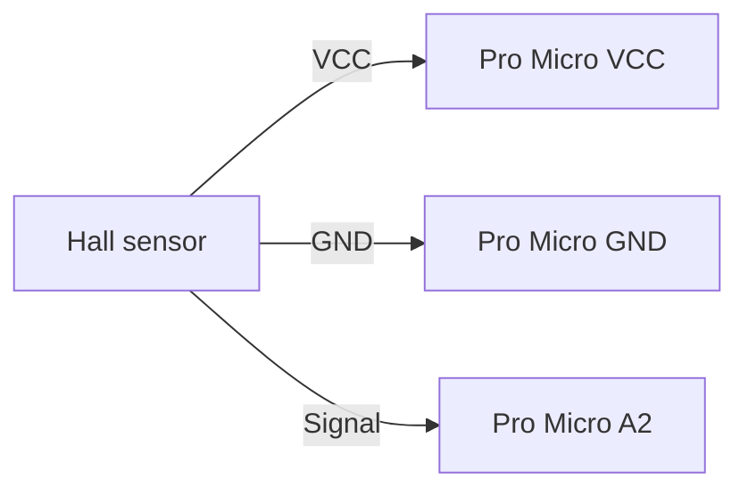

# Chinese Sim Racing Handbrake Firmware

Custom Arduino firmware for the 12-bit and 14-bit Chinese Sim Racing handbrake, which typically uses an Arduino Pro Micro (ATmega32U4) and an analog Hall sensor. The firmware presents the handbrake as a USB game controller and can also read two optional buttons.

## Background

This project is based on [Daniel Korgel's original firmware](https://github.com/Dak0r/Chinese-SimRacing-14Bit-Handbrake-Custom-Firmware-Arduino-Sketch). The current sketch keeps its USB joystick support and two-button example, with these changes:

- **Manual sensor calibration:** fixed `HALL_MIN_VALUE` and `HALL_MAX_VALUE` settings replace the original runtime auto-ranging. The axis no longer changes its calibration as you operate the lever.
- **Input clamping:** readings outside the calibrated range are constrained to the configured endpoints, so the reported axis remains within its intended range.
- **Validated calibration:** compilation stops with a clear error if the maximum is not greater than the minimum.
- **Explicit USB updates:** joystick state is sent explicitly, and the reported Z axis spans 0 to 4095 (12-bit values). This is not 14-bit analog input; the ATmega32U4's `analogRead()` is 10-bit by default.
- **More useful debug output:** optional serial diagnostics show both the raw Hall reading and mapped axis value at 115200 baud.

## Requirements

- Arduino IDE
- A compatible ATmega32U4 board, such as the Arduino Pro Micro
- The [Arduino Joystick Library by Matthew Heironimus](https://github.com/MHeironimus/ArduinoJoystickLibrary)

Install the joystick library from Arduino IDE's Library Manager by searching for **Joystick** by Matthew Heironimus. Alternatively, download the library from its [GitHub repository](https://github.com/MHeironimus/ArduinoJoystickLibrary) and install it using **Sketch > Include Library > Add .ZIP Library...**.

## Install With Arduino IDE

1. Download or clone this repository.
2. Open `ChineseHandbrakeCustomFirmware.ino` in Arduino IDE.
3. Connect the handbrake by USB. In **Tools > Board**, select **Arduino Leonardo** for a Pro Micro configured as a Leonardo-compatible ATmega32U4. Select the handbrake's port under **Tools > Port**. Board labels and port names can vary with the Pro Micro clone and installed board package.
4. Click **Verify** to compile, then **Upload** to flash the firmware.
5. After upload, the device should appear to the operating system as a USB game controller.

## Calibrate The Handbrake

Edit these constants near the top of the sketch before uploading:

```cpp
#define HALL_MIN_VALUE    270 // raw value with the handbrake released
#define HALL_MAX_VALUE    720 // raw value with the handbrake fully pulled
```

1. Enable debugging as described in [Debugging](#debugging) and open the Serial Monitor.
2. Note the `Hall` reading with the lever fully released; use it for `HALL_MIN_VALUE`.
3. Pull the lever fully and note the `Hall` reading; use it for `HALL_MAX_VALUE`.
4. Leave a little margin inside the mechanical travel if readings fluctuate, then upload again and verify that the reported `Z` value reaches close to 0 at rest and 4095 when fully pulled.

The values `270` and `720` are example starting points, not universal settings. Sensor readings depend on the handbrake, magnet position, and board. The sketch expects the raw reading to increase as the lever is pulled. If yours decreases, reverse the output endpoints in the `map()` call (change `0, AXIS_RESOLUTION` to `AXIS_RESOLUTION, 0`) while keeping `HALL_MIN_VALUE` lower than `HALL_MAX_VALUE`.

## Debugging

In the sketch, uncomment the debug define:

```cpp
#define DEBUG
```

Upload the sketch, then open **Tools > Serial Monitor** and set the baud rate to **115200**. Move the lever slowly through its full range. Each line shows:

- `Hall`: the raw analog reading from pin A2, normally 0-1023 on this board.
- `Z`: the value sent for the joystick axis, from 0-4095 after calibration and clamping.

Use the readings to set the released and fully pulled endpoints. If `Hall` does not change as the lever moves, check the sensor's power, ground, signal wire, and A2 connection. If compilation reports that `HALL_MAX_VALUE` must be greater than `HALL_MIN_VALUE`, correct the constants. Disable debugging again when finished if you do not need serial output.

## Hall Sensor Wiring

Connect the sensor's three terminals to the matching supply and signal pins. On the documented version 3.0 PCB, the Hall sensor connects to GND, VCC, and A2.



Use the voltage required by your sensor and board; do not exceed the board's permitted analog-input voltage. Confirm the pinout for your specific handbrake PCB revision before wiring. The optional buttons connect between digital pins **2** and **3** respectively and **GND**; the sketch configures them with `INPUT_PULLUP`, so a pressed button reads LOW.
